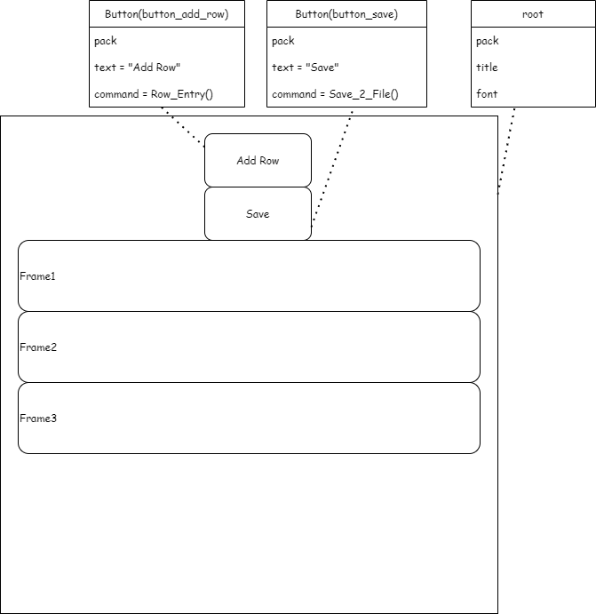

# HowTo develop embedded Diagram
Please read <a href="https://github.com/jgraph/drawio-integration" target="_blank">this</a> for a high-level introduction.

An example for integration into GitHub wikis is available here: https://github.com/jgraph/drawio/wiki/Embed-Diagrams

### Steps

1. create new diagram https://app.diagrams.net/?mode=github
    1. for first time it will ask for some instllation for draw.io into your github +  some permissions
2. give it a name and save as : editable bitmap Image (.png)
3. Locate the file in Github, in required location in your repo
4. keep the https link to the diagram in hand
5. copy the file edit-diagram.html to your repo in same location as readme.md file
6. in Readme.md file
    1. show the diagram as normal png (check below)
    2. use the diagram link to allow access for editing (check below)

# Architecture Diagram

<a href="https://app.diagrams.net/#HJacquelineBashta%2FTripPlanner%2Fmain%2FArchitecture%2FArchitectureDiagram.png" target="_blank">Edit</a>

